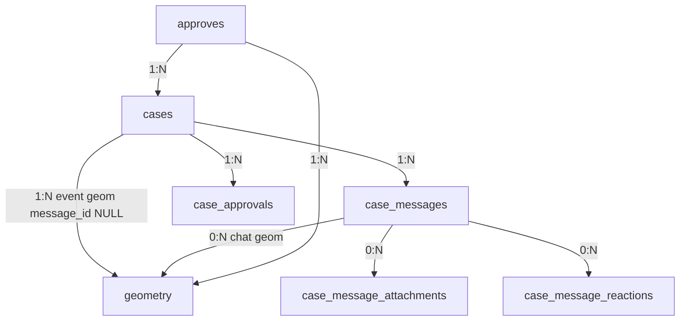

# Модель данных схемы `approval`

Документ описывает таблицы PostgreSQL/PostGIS схемы **`approval`**, смысл полей и связи между сущностями. Клиентский контракт HTTP — в [QGIS_API.md](QGIS_API.md).

Код ORM: [`approval/models.py`](../approval/models.py).

---

## Общая схема связей



Иерархия для UI (веб и QGIS):

1. **Согласование** (`approves`) — одно задание / пакет
2. **События / чаты** (`cases`) — primary + события по смежным `n_root`
3. **Сообщения** (`case_messages`) — лента чата
4. **Геометрия** (`geometry`) — либо «на событии», либо «на сообщении»

---

## `approval.approves`

Корень согласования. Создаётся из QGIS (`POST .../api/qgis/approves/`) или не используется напрямую из веба.

| Поле | Тип | Смысл |
|------|-----|--------|
| `id` | uuid PK | Внутренний id (`approve_id` в API) |
| `incoming_guid` | uuid UNIQUE | Внешний GUID задания из QGIS; = `TaskGUID` съёмки в `mggt_asu` |
| `n_root` | text[] | Агрегат смежных rootid из событий |
| `v_root` | text[] | Участники (опционально из QGIS) |
| `name` | text | Название для UI |
| `owners` | text[] | Агрегат `OwnerLegalPersonId` |
| `user` | text | Логин **инспектора** |
| `approved` | bool | Согласование закрыто (когда primary согласован) |
| `created_at` / `updated_at` | timestamptz | Служебные |

**После INSERT** триггер `trg_approves_create_primary_case` создаёт ровно один `cases` с `is_primary = true`.

---

## `approval.cases`

Событие согласования и одновременно контейнер чата.

| Поле | Тип | Смысл |
|------|-----|--------|
| `id` | uuid PK | `case_id` |
| `approve_id` | uuid FK → approves | Родительское согласование |
| `is_primary` | bool | `true` — основной чат (без event-геометрии) |
| `title` | text | Заголовок |
| `status` | text | Например `в работе` / `согласовано` |
| `approved` | bool | Событие полностью согласовано сторонами |
| `n_root` | text | RootId события; у primary обычно `NULL` |
| `owners` | text[] | Кто должен согласовать (OwnerLegalPersonId) |
| `participant_logins` | text[] | Доп. логины с доступом к чату |
| `created_by_login` | text | Кто создал |
| `closed_at` | timestamptz | Когда закрыто |

**Primary vs event:**

| | Primary | Event |
|--|---------|-------|
| Создание | триггер при INSERT approve | QGIS `events[]` или веб (создание из веба отключено) |
| Геометрия события | нет | строка в `geometry` с `message_id IS NULL` |
| `owners` | владелец съёмки по `incoming_guid` | владелец съёмки + стороны из `events[].owners` |

---

## `approval.case_messages`

Сообщения чата.

| Поле | Смысл |
|------|--------|
| `case_id` | К какому событию |
| `parent_id` | Ответ на другое сообщение (threading) |
| `author_login` | Автор |
| `body` | Текст (в API сериализуется как `text`) |
| `created_at` | Время |

При создании event case из QGIS автоматически пишется служебное сообщение «Событие создано.»

---

## `approval.geometry`

PostGIS-геометрии (SRID **4326**).

| Поле | Смысл |
|------|--------|
| `approve_id` | Согласование |
| `case_id` | Событие (может быть NULL при SET NULL) |
| `message_id` | Если задан — геометрия **сообщения**; если `NULL` — геометрия **события** |
| `geom` | Geometry |
| `label` | Подпись |
| `owner_legal_person_id` | Опционально |

Для карты QGIS используйте `GET .../approves/<id>/geometries/` — FeatureCollection с properties `message_id`, `case_id`, `is_primary`, `n_root`.

---

## `approval.case_approvals`

Фиксация факта согласования стороной.

| Поле | Смысл |
|------|--------|
| `case_id` | Событие |
| `owner_legal_person_id` | Согласование от владельца (XOR с инспектором) |
| `approver_login` | Согласование от инспектора |
| `approved_at` | Время |

Уникальность: одна запись на пару (case, owner) и (case, inspector login). Когда набраны все требуемые стороны — `cases.approved = true`.

---

## `approval.case_message_attachments`

Файлы к сообщениям (диск: `MEDIA_ROOT/approval/attachments/<case_id>/`).

Скачивание: `GET /approval/api/attachments/<id>/` (веб-сессия). В QGIS URL возвращается в `message.attachments[].url`.

---

## `approval.case_message_reactions`

Реакции на чужие сообщения: `in_progress` | `done`. Одна реакция на пару (message, reactor_login).

---

## Кто что видит

| Роль | Условие доступа |
|------|-----------------|
| Инспектор | `approves.user == login` — все cases согласования |
| Владелец | `OwnerLegalPersonId` ∈ `cases.owners` |
| Участник | `login` ∈ `cases.participant_logins` |

QGIS передаёт логин параметром `user`; сервер применяет те же правила, что веб (`approval/access.py`).

---

## Потоки данных

### Из QGIS → БД (ingest)

```
QGIS POST approves
  → approves (+ primary case trigger)
  → event cases + event geometries
  → стартовые case_messages
```

### Чат (веб или QGIS)

```
POST cases/<id>/messages
  → case_messages
  → optional geometry (message_id set)
  → optional attachments
```

### Согласование

```
POST cases/<id>/approve
  → case_approvals
  → возможно cases.approved / approves.approved
```
