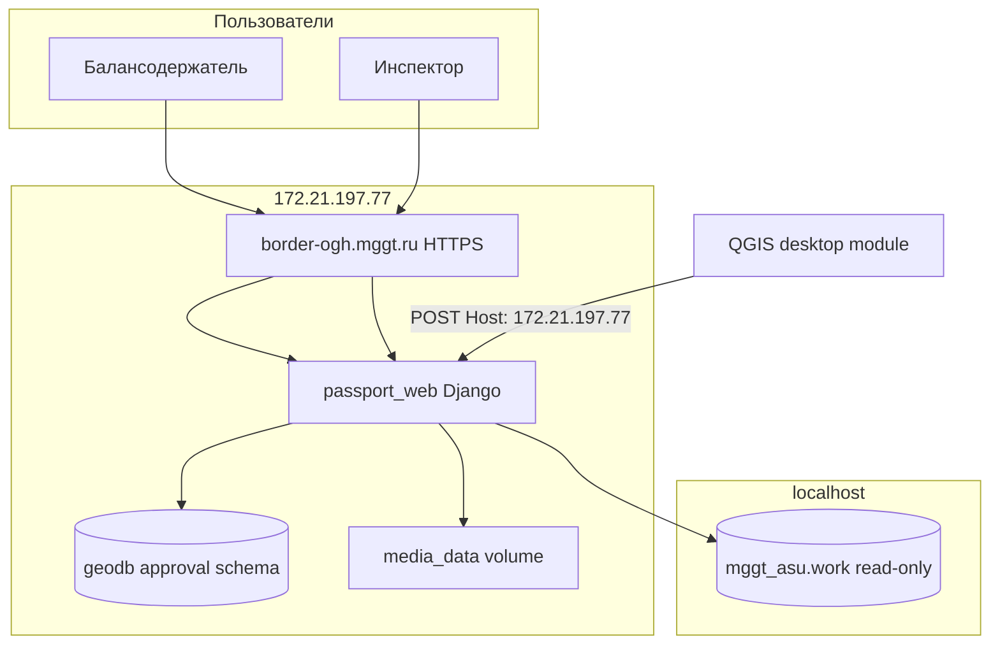

# Первый деплой модуля «Согласование» на прод (MGGT)

Чеклист для выката приложения `approval` на сервер **172.21.197.77** (`https://border-ogh.mggt.ru/approval/`).

Общая памятка по Docker, git и RED OS: [DEPLOY.md](../DEPLOY.md).

Связанные документы:

| Документ | Для кого |
|----------|----------|
| [QGIS_API.md](QGIS_API.md) | Разработчик QGIS-модуля (HTTP ingest) |
| [QGIS_INTEGRATION.md](QGIS_INTEGRATION.md) | Полная интеграция QGIS ↔ БД |
| [DEPLOY.md](../DEPLOY.md) | Обычное обновление Passport Editor на MGGT |

---

## Что выкатывается

Новое Django-приложение **`approval`** («Согласование»):

| Компонент | Назначение |
|-----------|------------|
| Веб-UI | `https://border-ogh.mggt.ru/approval/` — карта, чаты событий, согласование |
| Главная | Вкладка «Согласования», ссылка «Уведомления» с бейджем |
| Схема БД | `approval.*` в `geodb` (контейнер `passport_db`) |
| QGIS API | `POST http://172.21.197.77/approval/api/qgis/approves/` (только внутренний Host) |
| Карта съёмки | Read-only запросы к `mggt_asu.work` на **localhost** |
| Вложения чата | `media/approval/attachments/` (volume `media_data`) |

**Состояние веток (на момент подготовки документа):** код модуля в **`main`** (v3.0+), на **`deploy/mggt-docker`** модуля ещё нет — перед продом нужен merge `main` → `deploy/mggt-docker`.

---

## Архитектура на проде



---

## Предварительные условия

1. **Доступ SSH** к `pasp-ssh-user@172.21.197.77`, Docker через `sudo`.
2. **Сеть:** контейнер `passport_web` должен достучаться до **`localhost:5432`** (PostgreSQL `mggt_asu`). При включённом firewalld на RED OS — отдельное правило для исходящего трафика к `localhost` (см. [DEPLOY.md — firewalld](../DEPLOY.md#firewalld-red-os--mggt)).
3. **Пользователи** в таблице `users` (`ExternalUser`): у балансодержателей заполнен `OwnerLegalPersonId`; инспекторы — логин совпадает с полем `approval.approves.user`, заданным из QGIS.
4. **QGIS-модуль** на рабочих местах инспекторов настроен на внутренний URL API (см. [QGIS_API.md](QGIS_API.md)).
5. **`incoming_guid`** из QGIS совпадает с `TaskGUID` в `mggt_asu.work.*` на `localhost` — иначе карта съёмки будет пустой.

---

## Шаг 1. Merge в деплой-ветку (локально)

```bash
cd /Users/mihail/PY/GeoDjango   # путь к клону
git fetch origin main deploy/mggt-docker
git checkout deploy/mggt-docker
git reset --hard origin/deploy/mggt-docker
git merge -X theirs --no-edit origin/main
```

При конфликтах:

- **шаблоны, views, `approval/`** — брать из **`main`**;
- **`docker-compose.yml`**, **`docker-compose.images.yml`**, prod-настройки в **`pass_map/settings.py`** и **`pass_map/urls.py`** — проверить вручную, не затирать prod-конфиг.

Убедиться, что в merge попали:

- `approval/` (приложение, миграции, статика);
- `pass_map/settings.py` — `INSTALLED_APPS` содержит `"approval"`;
- `pass_map/urls.py` — `path("approval/", include("approval.urls"))`;
- `pass_viewer/views.py`, `templates/pass_viewer/home.html` — вкладка согласований на главной.

Пуш:

```bash
git push origin deploy/mggt-docker
git push hub deploy/mggt-docker
```

---

## Шаг 2. Переменные `.env` на сервере

Файл: `/opt/passport_editor_new/.env` (не в git). **Дополнить** существующий prod-набор из [DEPLOY.md](../DEPLOY.md):

```text
# --- Согласование: read-only витрина съёмки (обязательно для карты) ---
QGIS_DB_HOST=localhost
QGIS_DB_PORT=5432
QGIS_DB_NAME=mggt_asu
QGIS_DB_USER=<логин>
QGIS_DB_PASSWORD=<пароль>
QGIS_DB_CONNECT_TIMEOUT=10

# --- Согласование: QGIS ingest API (опционально, есть значения по умолчанию) ---
APPROVAL_QGIS_ALLOWED_HOSTS=172.21.197.77,127.0.0.1,localhost,testserver
APPROVAL_QGIS_API_URL=http://172.21.197.77/approval/api/qgis/approves/

# --- Согласование: вложения в чате (опционально) ---
# APPROVAL_ATTACHMENT_MAX_BYTES=10485760
# APPROVAL_WORK_MAX_FEATURES=5000
```

| Переменная | Обязательно | Примечание |
|------------|-------------|------------|
| `QGIS_DB_*` | **да** | Без них карта покажет ошибку «Не удалось загрузить объекты съёмки из mggt_asu» |
| `APPROVAL_QGIS_ALLOWED_HOSTS` | нет | По умолчанию уже включает `172.21.197.77`. **Не добавлять** `border-ogh.mggt.ru` |
| `APPROVAL_QGIS_API_URL` | нет | Справочный URL для QGIS-клиента |
| `DJANGO_CSRF_TRUSTED_ORIGINS` | **да** (уже на проде) | Нужен для POST из браузера на `/approval/api/...` |
| `DJANGO_USE_X_FORWARDED_HOST` | **да** (уже на проде) | `1` |

После правки `.env` переменные подхватываются только через **`--force-recreate web`**, не `docker restart`.

---

## Шаг 3. Обновление кода на сервере

```bash
cd /opt/passport_editor_new
git fetch origin deploy/mggt-docker
git reset --hard origin/deploy/mggt-docker
sudo docker compose -f docker-compose.yml -f docker-compose.images.yml up -d --force-recreate web
```

При старте контейнер выполняет `migrate` и `collectstatic`. В логах ожидается:

```bash
sudo docker logs --tail 80 passport_web
```

- `Applying approval.0001_create_approval_schema` … `0006_inspector_and_case_roots` (при первом деплое);
- `X static files copied` (в т.ч. `approval/css`, `approval/js`, `approval/icons`);
- `Starting gunicorn`.

### Ручная проверка миграций (при необходимости)

```bash
sudo docker exec passport_web python manage.py migrate approval --plan
sudo docker exec passport_web python manage.py migrate approval
```

### Проверка схемы

```bash
sudo docker exec passport_db psql -U postgres -d geodb -c "\dt approval.*"
```

Ожидаемые таблицы: `approves`, `cases`, `case_messages`, `case_message_attachments`, `case_approvals`, `geometry`.

---

## Шаг 4. Проверка сети до mggt_asu

Из контейнера веб-приложения:

```bash
sudo docker exec passport_web python -c "
from django.db import connections
c = connections['qgis']
c.ensure_connection()
print('QGIS DB OK:', c.settings_dict['HOST'])
"
```

При ошибке `No route to host` / timeout — проверить firewalld и маршрутизацию до `localhost:5432`.

---

## Шаг 5. Smoke-тесты после деплоя

### 5.1. Статика и маршрут

```bash
curl -s -o /dev/null -w "%{http_code}\n" https://border-ogh.mggt.ru/approval/
curl -s -o /dev/null -w "%{http_code}\n" https://border-ogh.mggt.ru/static/approval/js/events.js
```

Ожидается `302` (редирект на логин) и `200` соответственно.

### 5.2. QGIS API (с сервера или машины в сети МГГТ)

```bash
curl -s -o /dev/null -w "%{http_code}\n" \
  -X POST 'http://172.21.197.77/approval/api/qgis/approves/' \
  -H 'Host: 172.21.197.77' \
  -H 'Content-Type: application/json' \
  -d '{}'
```

Ожидается `400` (пустой JSON) — **не** `403` (значит Host разрешён) и **не** `404`.

Проверка блокировки публичного домена:

```bash
curl -s -o /dev/null -w "%{http_code}\n" \
  -X POST 'http://172.21.197.77/approval/api/qgis/approves/' \
  -H 'Host: border-ogh.mggt.ru' \
  -H 'Content-Type: application/json' \
  -d '{}'
```

Ожидается `403`.

Полный тестовый payload — в [QGIS_API.md](QGIS_API.md#пример-curl).

### 5.3. Веб-интерфейс

| Роль | Проверка |
|------|----------|
| Балансодержатель | Главная → вкладка «Согласования» → открыть согласование → карта, чат, кнопка «Согласовать» |
| Инспектор (`approves.user`) | Главная → видны согласования и бейдж «Уведомления»; `/approval/` → все cases, включая primary |
| После согласования primary | Статус на главной «Согласовано», бейдж гаснет; повторный POST из QGIS → `409` |

### 5.4. SQL-контроль

```sql
SELECT id, incoming_guid, name, owners, "user", approved, created_at
FROM approval.approves
ORDER BY created_at DESC
LIMIT 5;

SELECT c.id, c.is_primary, c.title, c.approved, c.status
FROM approval.cases c
JOIN approval.approves a ON a.id = c.approve_id
ORDER BY c.created_at DESC
LIMIT 10;
```

---

## Бизнес-логика (важно для приёмки)

1. **События создаются только из QGIS** — веб-эндпоинт `POST /approval/api/cases/` возвращает `410`.
2. **Согласование primary-чата** требует подписи владельца (из `cases.owners`) и инспектора (`approves.user`), если инспектор назначен.
3. **При полном согласовании primary** выставляется `approval.approves.approved = true` — блокирует повторный upsert из QGIS и меняет статус на главной.
4. **Secondary-события** согласуются отдельно; их закрытие **не** меняет `approves.approved`.
5. **Доступ к чатам:** балансодержатель видит cases, где его `OwnerLegalPersonId` в `cases.owners`; primary скрыт от смежников. Инспектор видит все cases своего согласования.

---

## Настройка QGIS-модуля

В конфигурации клиента QGIS:

```text
APPROVAL_QGIS_API_URL=http://172.21.197.77/approval/api/qgis/approves/
```

Запросы отправлять **на IP**, не на `https://border-ogh.mggt.ru`. Подробности полей JSON — [QGIS_API.md](QGIS_API.md).

---

## Media и вложения

Вложения чата сохраняются в:

```text
/app/media/approval/attachments/<case_id>/
```

Volume **`media_data`** на проде уже используется для экспортов; каталог `approval/attachments` создаётся автоматически при первой загрузке. Отдельный cron для очистки вложений **не настроен** (в отличие от `media/exports`).

Раздача файлов — через Gunicorn (`/media/...`), как и остальные media Passport Editor.

---

## Откат

Если нужно откатить только код (схему `approval` не трогать):

```bash
cd /opt/passport_editor_new
git reset --hard <предыдущий-коммит-deploy>
sudo docker compose -f docker-compose.yml -f docker-compose.images.yml up -d --force-recreate web
```

Схема `approval` в БД останется; при повторном деплое миграции будут `No migrations to apply`.

Полное удаление схемы (только в крайнем случае, **потеря данных**):

```sql
DROP SCHEMA IF EXISTS approval CASCADE;
```

После этого снова `python manage.py migrate approval`.

---

## Чеклист (кратко)

- [ ] Merge `main` → `deploy/mggt-docker`, push в `origin` и `hub`
- [ ] В `.env` на сервере: `QGIS_DB_*` (логин/пароль к `localhost`)
- [ ] `git pull` / `reset` на сервере, `--force-recreate web`
- [ ] Миграции `approval` применены (`\dt approval.*`)
- [ ] Из контейнера доступен `mggt_asu` на `localhost`
- [ ] `curl` QGIS API: `200/400` с Host `172.21.197.77`, `403` с Host `border-ogh.mggt.ru`
- [ ] Статика `/static/approval/...` отдаётся с `200`
- [ ] Логин балансодержателя и инспектора — главная и `/approval/`
- [ ] QGIS-модуль отправляет тестовое согласование
- [ ] После согласования primary: `approves.approved = true`, QGIS upsert → `409`

---

## После первого деплоя

Дальнейшие обновления модуля — по разделу «Обычное обновление» в [DEPLOY.md](../DEPLOY.md): merge `main` → `deploy/mggt-docker`, `git pull` на сервере, `--force-recreate web`. При новых миграциях `approval` они применятся автоматически при старте контейнера.
