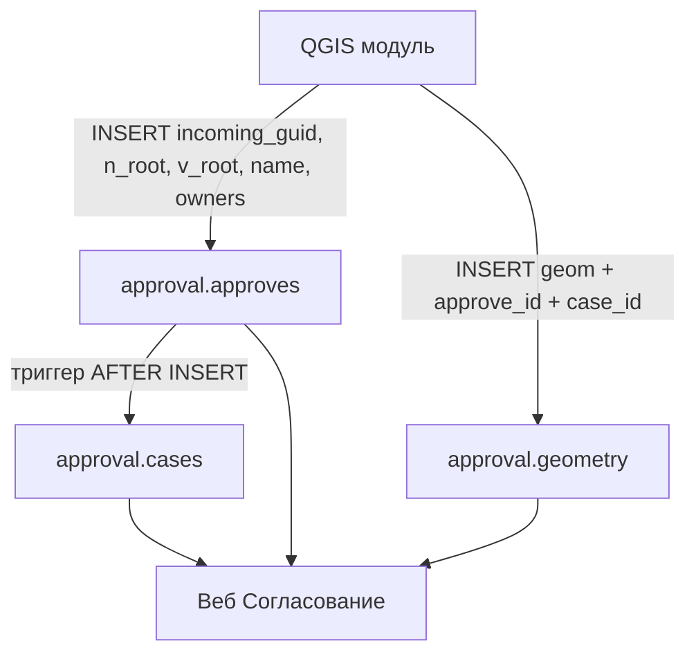

# Инструкция: отправка согласования из QGIS в geodb

Документ для разработчика QGIS-модуля, который создаёт запись согласования в PostgreSQL/PostGIS на **сервере МГГТ** (`geodb`, схема `approval`).

**Рекомендуемый способ** — HTTP API веб-приложения «Согласование» по внутреннему адресу сервера МГГТ. Полное описание endpoint, полей, ответов и примеров — в отдельном документе **[QGIS_API.md](QGIS_API.md)**.

```
POST http://172.21.197.77/approval/api/qgis/approves/
```

Публичный домен `https://border-ogh.mggt.ru` для этого API **не используется** — запросы через reverse-proxy отклоняются (HTTP 403). Альтернатива — прямая запись в БД `geodb` на `172.21.197.77` (разделы 4–5 ниже).

---

## 1. Что передаёт QGIS-модуль

| Поле | Тип в БД | Обязательно | Описание |
|------|----------|-------------|----------|
| `incoming_guid` | `uuid` | да | Внешний идентификатор задания. Генерируется **один раз в QGIS** (UUID v4). Используется как ключ идемпотентности и как `TaskGUID` при отображении слоёв съёмки на карте. |
| `v_root` | `text[]` | нет | Список rootid участников согласования, например `ARRAY['141564', '4066869', '1289566312']`. Может отсутствовать. |
| `user` | `text` | да | Логин инспектора (`approval.approves.user`). |
| `name` | `text` | да | Название/подпись согласования для отображения пользователю и заголовка primary case. |
| `events` | массив объектов | да | События согласования: `n_root`, `owners`, `name`, `geometry` (4326). |
| `brid` | — | нет | Справочное поле из QGIS; API игнорирует. |

Поля `n_root` и `owners` на верхнем уровне **не передаются** — API агрегирует их из `events[]` в `approval.approves`.

Primary case (`is_primary = true`) создаётся автоматически **без геометрии**; `owners` primary определяется по `OwnerLegalPersonId` объекта съёмки в `mggt_asu` (`TaskGUID = incoming_guid`).

### Пример значений

```
incoming_guid = 956c45bb-dc44-46a7-9944-9d1996fec147   -- сгенерировать в QGIS
v_root        = ARRAY['141564', '4066869', '1289566312']
user          = asidorov
name          = Согласование заявки из графика паспортизации 46998
events[0].n_root   = 10001260
events[0].owners   = ARRAY['9000022']
events[0].name     = Согласование заявок по паспортизации ...
events[0].geometry = Point (4326)
```

Полное описание HTTP API — в **[QGIS_API.md](QGIS_API.md)**.

---

## 2. UUID и идентификаторы: что генерировать, что не трогать

Чтобы не было конфликтов и дубликатов, разделите роли идентификаторов:

| Идентификатор | Кто создаёт | Комментарий |
|---------------|-------------|-------------|
| `incoming_guid` | **QGIS** | Единственный UUID, который модуль обязан сгенерировать сам (`gen_random_uuid()` в PostgreSQL или UUID v4 в Python/Qt). Храните его в QGIS-проекте/задании для повторных попыток отправки. |
| `approval.approves.id` | **БД** (`gen_random_uuid()`) | **Не передавать** из QGIS. Не подставлять `incoming_guid` вместо `id`. |
| `approval.cases.id` (основной чат) | **БД** (триггер) | **Не вставлять** строку в `cases` вручную — создаётся автоматически после INSERT в `approves`. |
| `approval.geometry.id` | **БД** (identity) | **Не передавать** — bigint, назначается автоматически. |

### Идемпотентность

На `incoming_guid` стоит ограничение **UNIQUE**. Повторный INSERT с тем же GUID завершится ошибкой.

Рекомендуемый алгоритм перед отправкой:

```sql
SELECT id FROM approval.approves WHERE incoming_guid = :incoming_guid;
```

- если строка найдена — согласование уже создано, не дублировать;
- если нет — выполнять создание в одной транзакции (см. раздел 4).

---

## 3. Схема данных и связи



После INSERT в `approves` срабатывает триггер `trg_approves_create_primary_case` и создаётся ровно **один** основной чат:

- `is_primary = true`
- `title = 'Основное событие'`
- `status = 'в работе'`

Геометрию основного события нужно привязать к этому чату через `case_id`.

---

## 4. Пошаговая процедура (SQL, альтернатива HTTP API)

Все шаги — в **одной транзакции**.

### Шаг 1. INSERT согласования

`id` не указываем — сгенерирует БД.

```sql
INSERT INTO approval.approves (incoming_guid, n_root, v_root, name, owners)
VALUES (
    '2e333940-831b-48f5-9751-acd0c2880974'::uuid,
    ARRAY['09811'],
    ARRAY['10482', '09811'],
    'Согласование границ паспорта ДТ-10482',
    ARRAY['10233594', '10233595']
)
RETURNING id;
```

Сохраните возвращённый `id` как `approve_id`.

### Шаг 2. Получить id основного чата

```sql
SELECT id
FROM approval.cases
WHERE approve_id = :approve_id
  AND is_primary IS TRUE;
```

Сохраните как `case_id`.

### Шаг 3 (опционально). Обновить заголовок основного чата из `name`

По умолчанию триггер ставит title «Основное событие». Если нужно показывать `name`:

```sql
UPDATE approval.cases
SET title = :name
WHERE id = :case_id;
```

### Шаг 4. INSERT геометрии основного события

Геометрия **обязательно** в SRID 4326.

**Из WKT (полигон):**

```sql
INSERT INTO approval.geometry (approve_id, case_id, geom, label)
VALUES (
    :approve_id,
    :case_id,
    ST_SetSRID(ST_GeomFromText('POLYGON((37.605 55.748, 37.618 55.748, 37.618 55.756, 37.605 55.756, 37.605 55.748))'), 4326),
    :name
);
```

**Из GeoJSON (удобно из QGIS):**

```sql
INSERT INTO approval.geometry (approve_id, case_id, geom, label)
VALUES (
    :approve_id,
    :case_id,
    ST_SetSRID(ST_GeomFromGeoJSON(:geojson_text), 4326),
    :name
);
```

**Если геометрия в другой СК (например МСК):** перед INSERT выполните `ST_Transform(geom, 4326)`.

`id` в `geometry` не указывать.

### Шаг 5. COMMIT

```sql
COMMIT;
```

При любой ошибке — `ROLLBACK`.

---

## 5. Полный пример транзакции

```sql
BEGIN;

-- проверка дубликата
DO $$
BEGIN
    IF EXISTS (
        SELECT 1 FROM approval.approves
        WHERE incoming_guid = '2e333940-831b-48f5-9751-acd0c2880974'::uuid
    ) THEN
        RAISE EXCEPTION 'Согласование с incoming_guid % уже существует', '2e333940-831b-48f5-9751-acd0c2880974';
    END IF;
END $$;

WITH new_approve AS (
    INSERT INTO approval.approves (incoming_guid, n_root, v_root, name, owners)
    VALUES (
        '2e333940-831b-48f5-9751-acd0c2880974'::uuid,
        ARRAY['09811'],
        ARRAY['10482', '09811'],
        'Согласование границ паспорта ДТ-10482',
        ARRAY['10233594']
    )
    RETURNING id, name
),
primary_case AS (
    SELECT c.id AS case_id, na.id AS approve_id, na.name
    FROM new_approve na
    JOIN approval.cases c ON c.approve_id = na.id AND c.is_primary IS TRUE
)
INSERT INTO approval.geometry (approve_id, case_id, geom, label)
SELECT
    pc.approve_id,
    pc.case_id,
    ST_SetSRID(ST_GeomFromGeoJSON('{"type":"Polygon","coordinates":[[[37.605,55.748],[37.618,55.748],[37.618,55.756],[37.605,55.756],[37.605,55.748]]]}'), 4326),
    pc.name
FROM primary_case pc;

COMMIT;
```

---

## 6. Подключение к БД (сервер МГГТ)

Параметры взяты из продакшен-окружения Passport Editor на МГГТ ([`DEPLOY.md`](../DEPLOY.md), [`.env.prod-remote.example`](../.env.prod-remote.example)).

### 6.1. geodb — запись согласования (схема `approval`)

Целевая БД для INSERT в `approval.approves`, `approval.cases`, `approval.geometry`.

| Параметр | Значение |
|----------|----------|
| Сервер (SSH) | `172.21.197.77`, пользователь `pasp-ssh-user` |
| Контейнер PostgreSQL | `passport_db` (PostGIS **16**) |
| Database | `geodb` |
| User | `postgres` |
| Password | из `/opt/passport_editor_new/.env` на сервере (`POSTGIS_DB_PASSWORD`) — **не хранить в репозитории и не передавать в чат** |
| Schema | `approval` |
| Порт на хосте сервера | `5433` (bind **только** `127.0.0.1`, с интернета закрыт firewalld) |
| Порт внутри Docker-сети | `5432` (хост `db` — для контейнера `passport_web`) |

Postgres **не слушает** `5433` на внешнем интерфейсе сервера. Подключение с рабочей станции — через **SSH-туннель** на localhost сервера.

#### Подключение QGIS с рабочей станции (рекомендуется)

1. Поднять туннель (в отдельном терминале):

```bash
ssh -N -L 5433:127.0.0.1:5433 pasp-ssh-user@172.21.197.77
```

2. В QGIS / psycopg2 / SQL-клиенте:

| Параметр | Значение |
|----------|----------|
| Host | `127.0.0.1` |
| Port | `5433` |
| Database | `geodb` |
| User | `postgres` |
| Password | `POSTGIS_DB_PASSWORD` с сервера |

Строка подключения (пароль подставить локально, не коммитить):

```
postgresql://postgres:<POSTGIS_DB_PASSWORD>@127.0.0.1:5433/geodb
```

#### Подключение с самого сервера МГГТ

Если QGIS-модуль запускается на `172.21.197.77`:

```bash
sudo docker exec -it passport_db psql -U postgres -d geodb
```

или через host port:

```
postgresql://postgres:<POSTGIS_DB_PASSWORD>@127.0.0.1:5433/geodb
```

#### Права на запись

Нужны `INSERT` / `SELECT` / `UPDATE` на таблицы:

- `approval.approves`
- `approval.cases` (только `UPDATE title`, если меняете заголовок основного чата)
- `approval.geometry`

Строки в `approval.cases` с `is_primary = true` **не создавать вручную** — их создаёт триггер после INSERT в `approves`.

### 6.2. mggt_asu — витрина съёмки (схема `work`, только чтение)

Объекты съёмки для карты читаются из отдельной БД. Сюда QGIS **не пишет** согласование, но отсюда берётся связь `TaskGUID` ↔ `incoming_guid`.

| Параметр | Значение |
|----------|----------|
| Host | `172.21.197.51` |
| Port | `5432` |
| Database | `mggt_asu` |
| User | `mstukalov` |
| Password | выдаёт администратор QGIS/БД (личный пароль, не в git) |
| Schema | `work` |
| Колонка задания | `TaskGUID` (тип `uuid`) |
| Колонка геометрии | `Geometry` (SRID источника **980077**, в веб-приложении трансформируется в 4326) |

Строка подключения (пароль локально):

```
postgresql://mstukalov:<QGIS_DB_PASSWORD>@172.21.197.51:5432/mggt_asu
```

### 6.3. Локальная разработка (не МГГТ)

Только для отладки на Mac/CI: Docker `postgis-db`, `127.0.0.1:5433`, `postgres` / `postgres`. См. [`docker-compose.local.yml`](../docker-compose.local.yml) и [`README.md`](../README.md). На прод **не** запускать `migrate` с рабочей машины через туннель без согласования.

---

## 7. Связь с картой съёмки (mggt_asu)

Веб-карта дополнительно подгружает объекты из БД **`mggt_asu`** (`172.21.197.51`), схема **`work`**, фильтруя по колонке **`TaskGUID`** = **`incoming_guid`** согласования в `geodb`.

Поэтому:

1. `incoming_guid`, который QGIS записывает в `approval.approves` на **`172.21.197.77`**, должен **совпадать** с `TaskGUID` в таблицах `work.*` на **`172.21.197.51`**.
2. QGIS-модуль съёмки (`mggt_asu`) и модуль отправки согласования (`geodb`) должны использовать **один и тот же** GUID задания.
3. Геометрию для `approval.geometry` сохраняйте в **SRID 4326**; в `work.*` геометрия может быть в SRID 980077 — при копировании используйте `ST_Transform`.

---

## 8. Ограничения и типичные ошибки

| Ошибка | Причина | Решение |
|--------|---------|---------|
| `duplicate key value violates unique constraint "approves_incoming_guid_key"` | Повторная отправка с тем же `incoming_guid` | Проверять наличие записи до INSERT |
| `duplicate key value violates unique constraint "cases_one_primary_per_approve"` | Ручной INSERT второго `is_primary = true` | Не создавать `cases` вручную |
| Согласование не видно в веб-UI | Пустой или неверный `owners` | Указать `OwnerLegalPersonId` всех сторон |
| Геометрия не на карте чата | Нет строки в `geometry` или неверный SRID | INSERT в `geometry`, SRID 4326, привязка к `case_id` primary |
| `approves.id` конфликтует | QGIS подставил свой UUID в `id` | Не заполнять колонку `id` |

---

## 9. Что создаётся автоматически (не трогать из QGIS)

| Объект | Когда |
|--------|-------|
| `approves.id` | DEFAULT при INSERT |
| `approves.created_at`, `updated_at` | DEFAULT / триггер |
| `cases` (основной чат) | Триггер `trg_approves_create_primary_case` |
| `geometry.id` | GENERATED BY DEFAULT AS IDENTITY |
| Дополнительные события-чаты | Только пользователи через веб-UI |

---

## 10. Проверка после отправки

```sql
-- согласование
SELECT id, incoming_guid, n_root, v_root, name, owners, approved
FROM approval.approves
WHERE incoming_guid = '2e333940-831b-48f5-9751-acd0c2880974'::uuid;

-- основной чат
SELECT c.id, c.is_primary, c.title, c.status
FROM approval.cases c
JOIN approval.approves a ON a.id = c.approve_id
WHERE a.incoming_guid = '2e333940-831b-48f5-9751-acd0c2880974'::uuid;

-- геометрия
SELECT g.id, ST_AsText(g.geom), g.label
FROM approval.geometry g
JOIN approval.approves a ON a.id = g.approve_id
WHERE a.incoming_guid = '2e333940-831b-48f5-9751-acd0c2880974'::uuid;
```

В веб-приложении: войти под пользователем, у которого `users."OwnerLegalPersonId"` входит в `owners`, открыть `https://border-ogh.mggt.ru/approval/`.

---

## 11. Миграции схемы

Актуальная схема создаётся миграциями Django-приложения `approval`:

```bash
cd GeoDjango
python manage.py migrate approval
```

Файлы миграций: `GeoDjango/approval/migrations/`.

Перед первой отправкой из QGIS убедитесь, что на целевой БД применены все миграции (в т.ч. `0004` — поля `n_root`, `v_root`, `name`).

---

## 12. Контакты по доработкам

По вопросам расширения API (аутентификация, GET-статус по `incoming_guid`, дополнительные поля) — согласовать с командой GeoDjango.
